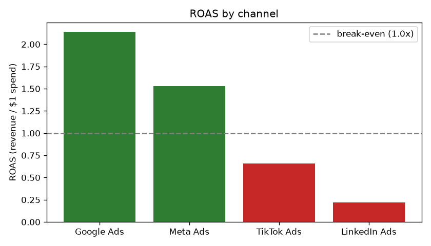
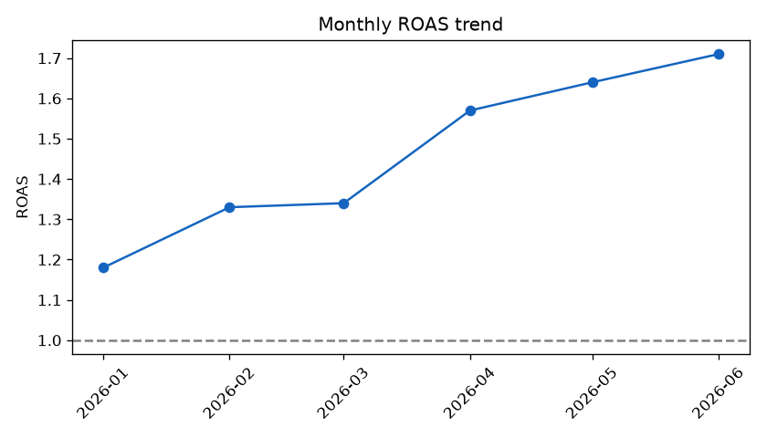
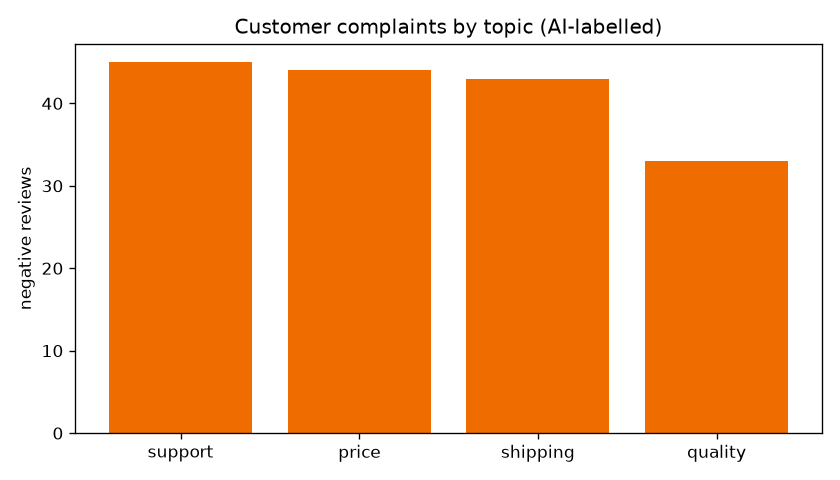

# Marketing Analytics — Ad Performance & AI Review Insights

A small end-to-end analytics project for a direct-to-consumer (DTC) skincare
brand running paid ads on four channels. It answers the questions a growth team
actually asks — *which channel is profitable, why, and what are customers
unhappy about* — using **SQL on PostgreSQL** for the numbers and a **local LLM**
to read what SQL can't: the free-text reviews.

> **Note:** the dataset is **synthetic** (generated by `tools/generate_data.py`,
> seeded for reproducibility). Metrics sit in realistic ranges per channel but
> are simulated — this project demonstrates the *analysis*, not real figures.

---

## The pipeline

```
tools/generate_data.py        # simulate campaigns, daily spend/revenue, reviews
        │  (CSV)
        ▼
PostgreSQL (star schema)       # campaigns ─1:N─ daily_performance ; reviews
        │
        ├── sql/               # 5 analyses: ROAS, funnel, trend, product, complaints
        │
        ├── ai/classify_reviews.py   # Ollama qwen2.5 → sentiment + topic per review
        │        → review_labels     # AI-derived layer, kept separate from raw data
        │
        └── charts/make_charts.py    # matplotlib → PNG charts below
```

**Data model (star schema):** a `campaigns` dimension table joined to a
`daily_performance` fact table via a foreign key, plus `reviews` and an
AI-generated `review_labels` table. Money is stored as `NUMERIC`, never `FLOAT`.

---

## Key findings

### 1. Two of four channels lose money



Google (2.14x) and Meta (1.53x) are profitable; TikTok (0.66x) and LinkedIn
(0.22x) burn cash. Blended ROAS is **1.44x**.

### 2. *Why* — the funnel explains it

| Channel | CTR | CVR | CPC | **CAC** | ROAS |
|---|---|---|---|---|---|
| Google | 3.20% | **5.76%** | $1.45 | **$25** | 2.14x |
| Meta | 1.50% | 2.40% | $0.86 | $36 | 1.53x |
| TikTok | 1.21% | 0.54% | **$0.45** | $84 | 0.66x |
| LinkedIn | 0.60% | 1.26% | $3.26 | **$259** | 0.22x |

The trap: **TikTok has the cheapest clicks ($0.45 CPC) but the 2nd-worst cost
per customer ($84 CAC)** — cheap clicks that rarely convert. LinkedIn's CAC is
**10× Google's**: wrong audience for a DTC skincare brand.

### 3. Performance improved as losing campaigns ended



ROAS climbed **1.18x → 1.71x (+45%)** over six months — not because channels
improved, but because the loss-making campaigns (LinkedIn, TikTok) ended and the
budget mix shifted toward Google/Meta. The lesson: cut the losers sooner.

### 4. Customers complain about service & price, not the product



AI-labelled complaint topics: **support (45)** and **price (44)** lead; quality
is lowest (33). The product itself is fine — invest in support and revisit
pricing.

### 5. The AI labels are trustworthy (validated)

The LLM never saw the star rating, yet its sentiment lines up with it:

| AI sentiment | count | avg original rating |
|---|---|---|
| positive | 255 | **4.67** ⭐ |
| negative | 165 | **1.70** ⭐ |

Cross-checking the model against an independent signal (the rating) shows the
labels are reliable — not taken on faith.

---

## Tech stack

- **PostgreSQL** (star schema, foreign keys, window-free aggregate SQL)
- **Python** — `psycopg` (DB), `pandas` (read), `matplotlib` (charts)
- **Ollama + qwen2.5:7b** — local LLM for review classification (zero cost, data stays local)

## Run it

Prerequisites: a PostgreSQL database named `marketing`, and Ollama running with
`qwen2.5:7b` pulled.

```bash
pip install -r requirements.txt

python3 tools/generate_data.py                 # 1. simulate data -> data/*.csv
psql "$MARKETING_DSN" < sql/schema.sql          # 2. create tables
# load the three CSVs into campaigns / daily_performance / reviews (\copy)

python3 ai/classify_reviews.py                  # 3. AI labels reviews -> review_labels
python3 charts/make_charts.py                   # 4. render charts -> charts/*.png

# run any analysis:
psql "$MARKETING_DSN" < sql/01_channel_roas.sql
```

## What's inside

```
tools/generate_data.py   synthetic data generator (seeded, reproducible)
sql/                     schema + 5 analyses (ROAS, funnel, trend, product, complaints)
ai/classify_reviews.py   LLM review classifier (sentiment + topic), idempotent
charts/make_charts.py    3 PNG charts straight from the database
data/                    generated CSVs
```
